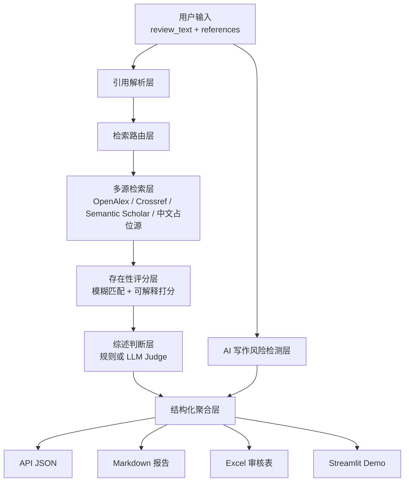
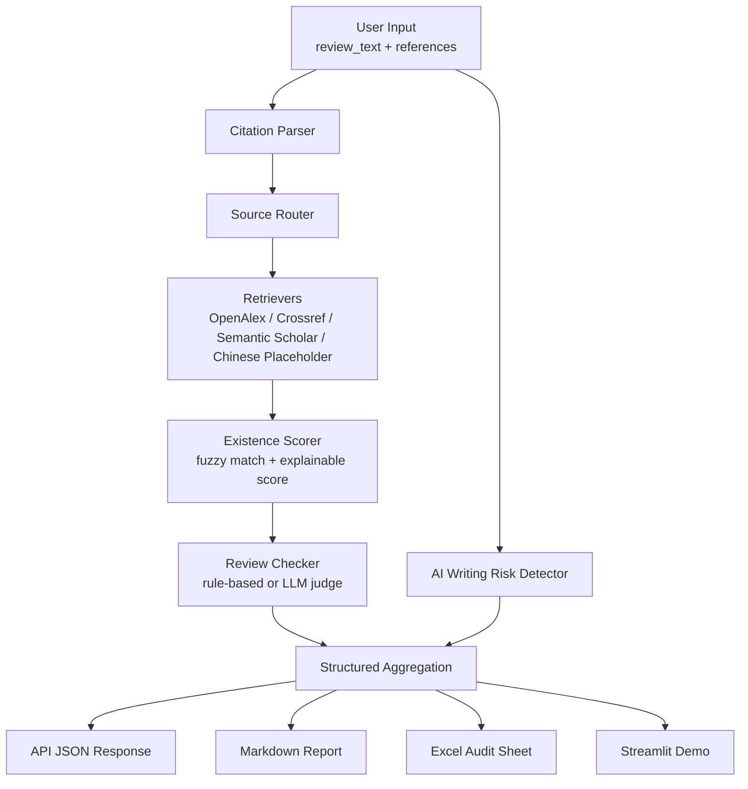

# Literature Review Verifier Agent
# 文献综述审核智能体：你的参考文献存在吗？ 


 中文说明

Literature Review Verifier Agent 是一个面向本地运行与 GitHub 展示的工程化原型，用于辅助核验文献综述中是否存在可疑引用、元数据错配、综述结论支撑不足，以及较高的 AI 写作痕迹风险。项目基于 FastAPI、Streamlit、规则系统、公开学术元数据检索链路，以及可扩展的 LoRA 微调接口构建，默认目标模型为 `Qwen/Qwen3-4B-Instruct-2507`。

## 项目速览
- 输入：文献综述文本 + 参考文献列表
- 输出：引用存在性判断、综述支持性判断、AI 写作风险提示、Markdown 报告、Excel 审核表
- 模式：`rule`、`base_llm`、`lora_llm`
- 默认模型目标：`Qwen/Qwen3-4B-Instruct-2507`
- 当前双语状态：支持中英文输入，但英文自动核验覆盖强于中文

## 快速开始
```bash
python -m venv .venv
.venv\Scripts\activate
pip install -r requirements.txt
uvicorn app.main:app --reload
```
打开 `http://127.0.0.1:8000/docs` 查看 API，或者运行：
```bash
streamlit run webui/streamlit_app.py
python scripts/run_demo.py
```

## Windows 一键启动
你可以直接在资源管理器里双击这些文件：
- `setup_and_run_api.bat`：自动创建 `.venv`、安装依赖并启动 FastAPI
- `setup_and_run_webui.bat`：自动创建 `.venv`、安装依赖并启动 Streamlit
- `setup_and_run_demo.bat`：自动创建 `.venv`、安装依赖并运行命令行 Demo
- `start_all.bat`：同时打开 API 和 WebUI 两个窗口
## 架构流程图


## Demo 预览说明
仓库中已经包含可直接运行的本地 Demo 与样例数据：
- API 入口：[main.py](/d:/literature_review_verifier/app/main.py)
- Streamlit Demo：[streamlit_app.py](/d:/literature_review_verifier/webui/streamlit_app.py)
- CLI Demo：[run_demo.py](/d:/literature_review_verifier/scripts/run_demo.py)
- 示例输入：[sample_input.json](/d:/literature_review_verifier/data/samples/sample_input.json)

运行后你可以得到：
- `likely_exists` / `possible_match` / `weak_match` / `not_found` 等引用存在性标签
- `supported` / `partially_supported` / `unsupported` / `uncertain` 等支撑性标签
- `fabricated_reference`、`irrelevant_reference`、`causal_overstatement` 等问题类型
- AI 写作风险分数与修改建议
- 输出到 [data/processed](/d:/literature_review_verifier/data/processed) 的 Markdown 和 Excel 文件

## 项目背景与目标
LLM 可以帮助撰写文献综述，但也可能带来以下问题：
- 编造参考文献
- 作者、标题、年份、期刊、DOI 等元数据错配
- 用不相关文献支撑论点
- 把“相关”夸大成“因果”
- 生成模板化、痕迹较重的 AI 文风

本项目的目标不是替代人工审稿，而是提供一个本地可运行、结构清晰、可继续迭代的核验 Agent 原型，帮助用户在提交前做自查。

## 为什么它不能替代人工学术审查
- 它只是辅助核验工具，不是正式学术审查系统。
- 外部公开元数据源可能不完整、延迟或存在差异。
- 中文公开资源覆盖不稳定，因此中文文献未命中时应优先输出 `uncertain`，而不是武断判定为假文献。
- Google Scholar 不作为核心自动检索源，仅适合作为 README 中建议的人工复核补充渠道。
- LoRA 模型的职责是基于 retrieval evidence + rule results 做结构化判断，而不是凭空“知道”文献真假。
- AI 写作风险检测只用于自查、润色和修改建议，不应用于正式处罚或纪律认定。

## 当前双语支持情况
当前项目支持中英文输入，但能力是“非对称”的：
- 英文链路更完整：英文文献默认走 `OpenAlex + Crossref + Semantic Scholar`，自动核验能力更强。
- 中文链路更保守：支持中文引用解析、中文规则核验、中文 AI 写作风险特征提取，但公开自动检索覆盖有限。
- 中文文献如果自动未命中，系统会倾向输出 `uncertain`，这是一种刻意设计的保守策略。
- 因此，这个项目可以说是“支持双语输入与基础核验”，但英文自动核验能力当前明显强于中文。

## 核心功能
- 基础中英文参考文献解析。
- 检索源路由。
- 外文公开元数据多源检索：
  - OpenAlex
  - Crossref
  - Semantic Scholar
- 中文公开资源保守占位 provider。
- 可解释的存在性打分。
- 规则化综述支撑性判断。
- AI writing risk detection。
- 严格 JSON 输出与 Pydantic schema。
- Markdown 报告与 Excel 审核表导出。
- FastAPI 接口。
- Streamlit Web Demo。
- 面向 Qwen3-4B-Instruct-2507 的 LoRA 训练、评估和推理脚本。

## 系统架构
- 输入层：`review_text` 与 `references`
- 解析层：提取 authors、title、year、venue、doi、language、raw_text
- 路由层：按语言和字段选择检索源
- 检索层：OpenAlex、Crossref、Semantic Scholar、中文保守 provider
- 打分层：模糊匹配与存在性综合评分
- 综述判断层：rule-based + 可选 LLM judge
- AI 风险层：特征提取 + heuristic scorer
- 报告层：JSON、Markdown、Excel
- 训练层：数据构建、prompt formatter、LoRA 微调、评估与推理

## 安装方式
```bash
python -m venv .venv
.venv\Scripts\activate
pip install -r requirements.txt
```

## 环境变量
复制 `.env.example` 为 `.env`，然后按需修改：
- `LLM_BACKEND=dummy|hf_qwen|lora_qwen`
- `HF_MODEL_NAME_OR_PATH=Qwen/Qwen3-4B-Instruct-2507`
- `LORA_ADAPTER_PATH=path/to/adapter`
- `API_TIMEOUT_SECONDS=10`
- `MAX_RETRIEVAL_CANDIDATES=5`
- `REPORT_OUTPUT_DIR=data/processed`

## 如何启动 FastAPI
```bash
uvicorn app.main:app --reload
```
访问 `http://127.0.0.1:8000/docs`

## 如何启动 Streamlit
```bash
streamlit run webui/streamlit_app.py
```

## 如何运行本地 Demo
```bash
python scripts/run_demo.py
```

## 如何准备训练数据
```bash
python training/build_dataset.py --input_file data/samples/toy_train.jsonl --output_dir data/processed/dataset
```

## 如何执行 LoRA 微调
```bash
python training/train_lora.py ^
  --model_name_or_path Qwen/Qwen3-4B-Instruct-2507 ^
  --train_file data/processed/dataset/train.jsonl ^
  --val_file data/processed/dataset/val.jsonl ^
  --output_dir data/processed/qwen_lora ^
  --max_length 1024 ^
  --batch_size 1 ^
  --num_train_epochs 1 ^
  --learning_rate 2e-4 ^
  --lora_r 8 ^
  --lora_alpha 16 ^
  --lora_dropout 0.05
```

## 如何加载 LoRA Adapter 做推理
```bash
python training/infer_lora.py ^
  --model_name_or_path Qwen/Qwen3-4B-Instruct-2507 ^
  --adapter_path data/processed/qwen_lora ^
  --instruction "Judge whether the citation exists and whether the review claim is supported." ^
  --input_json "{\"review_text\": \"...\", \"citation\": {}}"
```

## API 文档说明
更完整的请求体与返回体示例见 [api_examples.md](/d:/literature_review_verifier/docs/api_examples.md)。
## API 调用示例
先启动 API：
```bash
uvicorn app.main:app --reload
```

然后发送请求：
```bash
curl -X POST "http://127.0.0.1:8000/verify" ^
  -H "Content-Type: application/json" ^
  -d "{\"review_text\":\"Twenge 等人的研究讨论了屏幕时间与青少年心理健康之间的关联。\",\"references\":[\"Twenge J M, Joiner T E, Rogers M L, Martin G N. Increases in depressive symptoms, suicide-related outcomes, and suicide rates among U.S. adolescents after 2010 and links to increased new media screen time. Clinical Psychological Science. 2018. doi:10.1177/2167702617723376\",\"张三，李四. 数字平台使用与大学生心理压力关系研究[J]. 现代传播，2021.\"],\"mode\":\"rule\",\"generate_reports\":true}"
```

返回结果示例片段：
```json
{
  "review_text": "Twenge 等人的研究讨论了屏幕时间与青少年心理健康之间的关联。",
  "item_results": [
    {
      "citation": {
        "title": "Increases in depressive symptoms, suicide-related outcomes...",
        "language": "en"
      },
      "existence_result": {
        "existence_label": "likely_exists",
        "existence_score": 0.84
      },
      "review_check_result": {
        "support_label": "partially_supported",
        "issue_types": ["uncertain"]
      }
    }
  ],
  "ai_writing_check": {
    "ai_risk_score": 28,
    "ai_risk_label": "low"
  },
  "summary": {
    "total_citations": 2,
    "manual_review_recommended": true,
    "bilingual_support_note": {
      "status": "supported_with_asymmetric_coverage"
    }
  }
}
```
## AI Writing Risk Detection 说明
该模块实现的是 “AI writing risk detection”，不是“精准 AI 率检测器”。
它主要用于：
- 自查文本是否过于模板化
- 提示高风险表达模式
- 给出更自然的人类化修改建议

它不适用于：
- 正式作者身份鉴定
- 纪律处罚
- 学术不端定性

## 风险与局限
- 外文自动检索主链路基于公开学术元数据源，不等于全文事实库。
- Google Scholar 不作为核心自动数据源。
- 中文公开资源覆盖有限，因此中文结论必须保守。
- 当前规则系统主要依赖标题、摘要、关键词重合与启发式规则，对复杂学科语义仍有局限。
- 当前训练脚本强调“能跑”和“可扩展”，还不是完整生产训练框架。

## 后续扩展方向
- 加入更稳健的中文公开元数据 provider。
- 增加 citation 到句子的显式对齐能力。
- 加入缓存、重试与速率限制处理。
- 强化 structured JSON 输出评估。
- 扩充训练数据规模和标注规范。

## 最小可运行说明
1. 安装依赖。
2. 运行 `python scripts/run_demo.py` 做本地 CLI 演示。
3. 运行 `uvicorn app.main:app --reload` 启动 API。
4. 运行 `streamlit run webui/streamlit_app.py` 启动 Web Demo。

默认模式是 `rule`，因此即使没有配置 LLM 或 LoRA adapter，项目也可以本地跑通。
仓库还包含 [LICENSE](/d:/literature_review_verifier/LICENSE)、[CHANGELOG.md](/d:/literature_review_verifier/CHANGELOG.md) 和 Windows 启动脚本，方便直接展示与本地使用。


 ---
 # Literature Review Verifier Agent


Literature Review Verifier Agent is a local-first engineering prototype for checking whether a literature review may contain suspicious citations, mismatched metadata, weakly supported claims, or elevated AI writing risk patterns. It is built as a GitHub-ready Python project with FastAPI, Streamlit, rule-based verification, public metadata retrieval, and extension points for LoRA fine-tuning on Qwen3-4B-Instruct-2507.

## Project Snapshot
- Input: literature review text plus reference list
- Output: structured citation verification, review support judgement, AI writing risk hints, Markdown report, and Excel audit sheet
- Modes: `rule`, `base_llm`, `lora_llm`
- Default model target: `Qwen/Qwen3-4B-Instruct-2507`
- Current bilingual status: English and Chinese input supported, with stronger automated metadata coverage for English

## Quick Start
```bash
python -m venv .venv
.venv\Scripts\activate
pip install -r requirements.txt
uvicorn app.main:app --reload
```
Open `http://127.0.0.1:8000/docs` for the API, or run:
```bash
streamlit run webui/streamlit_app.py
python scripts/run_demo.py
```
On Windows, you can also use the helper scripts:
```bat
run_api.bat
run_webui.bat
run_demo.bat
```

## Windows One-Click Launch
You can double-click these files in Windows Explorer:
- `setup_and_run_api.bat`: create `.venv`, install dependencies, and start FastAPI
- `setup_and_run_webui.bat`: create `.venv`, install dependencies, and start Streamlit
- `setup_and_run_demo.bat`: create `.venv`, install dependencies, and run the CLI demo
- `start_all.bat`: open both the API and WebUI in separate terminal windows
## Architecture Diagram


## Demo Preview
The repository includes a runnable local demo and sample data:
- API entry: [main.py](/d:/literature_review_verifier/app/main.py)
- Streamlit demo: [streamlit_app.py](/d:/literature_review_verifier/webui/streamlit_app.py)
- CLI demo: [run_demo.py](/d:/literature_review_verifier/scripts/run_demo.py)
- Sample request: [sample_input.json](/d:/literature_review_verifier/data/samples/sample_input.json)

When you run the demo, the system returns:
- citation existence labels such as `likely_exists`, `possible_match`, `weak_match`, `not_found`
- review support labels such as `supported`, `partially_supported`, `unsupported`, `uncertain`
- issue types like `fabricated_reference`, `irrelevant_reference`, and `causal_overstatement`
- AI writing risk score and humanization suggestions
- Markdown and Excel outputs in [data/processed](/d:/literature_review_verifier/data/processed)

## Project Background And Goal
Academic writing assistants can help draft literature reviews, but they can also introduce fabricated references, metadata errors, topic-irrelevant citations, and overconfident summaries. This project provides a practical verifier workflow:
- parse references
- retrieve public metadata evidence
- score whether the reference likely exists
- judge whether the review claim is supported conservatively
- estimate AI writing risk patterns without claiming absolute authorship attribution
- export structured reports for self-check and manual review

## Why This Project Cannot Replace Human Academic Review
- It is an assistive verification tool, not a formal academic judgement system.
- Public metadata sources can be incomplete, delayed, or inconsistent.
- Chinese public-source coverage is not always complete, so missed Chinese references should default toward `uncertain` instead of “fake”.
- Google Scholar is not a core automated source in this project; it is only suggested for manual follow-up review.
- The LoRA model is designed to judge under evidence constraints, not to magically “know” whether a citation is true with 100% certainty.
- AI writing risk detection is only for self-check and revision guidance, not for formal punishment or disciplinary decisions.

## Core Features
- Reference parsing for basic Chinese and English citation strings.
- Retrieval routing for English and Chinese references.
- Public-source retrieval chain for English references:
  - OpenAlex
  - Crossref
  - Semantic Scholar
- Conservative Chinese provider placeholder with DOI and manual-review fallback guidance.
- Explainable existence scoring:
  - `0.45 * title_similarity`
  - `0.20 * author_overlap`
  - `0.15 * year_match`
  - `0.10 * venue_similarity`
  - `0.10 * doi_match`
- Rule-based review checking for:
  - `fabricated_reference`
  - `mismatched_metadata`
  - `irrelevant_reference`
  - `overclaim`
  - `causal_overstatement`
  - `claim_not_supported`
  - `uncertain`
- AI writing risk detection with heuristic features and structured output.
- Strict JSON-oriented schemas with Pydantic.
- Markdown and Excel report export.
- FastAPI endpoint and Streamlit demo.
- LoRA training, evaluation, and inference scripts for future Qwen3-4B-Instruct-2507 extension.

## Bilingual Support Status
The project currently supports bilingual input, but the coverage is intentionally asymmetric.
- English: stronger automated verification path through OpenAlex, Crossref, and Semantic Scholar.
- Chinese: supported in parsing, routing, rule-based checking, and AI writing risk detection, but automated public-source coverage is incomplete.
- When Chinese references are not matched automatically, the system is designed to prefer `uncertain` instead of making an aggressive fake-reference judgement.
- This means the project is bilingual in input handling, yet English metadata verification is currently stronger than Chinese metadata verification.

## System Architecture
- Input layer: review text and raw reference list.
- Parsing layer: extract authors, title, year, venue, DOI, language, raw text.
- Routing layer: choose retrieval providers by language and available fields.
- Retrieval layer: OpenAlex, Crossref, Semantic Scholar, conservative Chinese public-source placeholder.
- Scoring layer: fuzzy matching and explainable existence score.
- Review judgement layer: rule-based checker with optional LLM JSON judge and graceful fallback.
- AI writing risk layer: feature extraction plus heuristic scorer, with optional LLM fallback wrapper.
- Report layer: JSON response, Markdown report, Excel export.
- Training layer: toy dataset builder, formatter, LoRA fine-tuning, evaluation, and inference scripts.

## Agent Workflow
1. User submits `review_text` and `references`.
2. The parser builds `CitationRecord` objects.
3. The source router selects retrieval sources.
4. Retriever clients fetch metadata candidates with timeout and exception handling.
5. The existence scorer ranks candidates and returns an explainable `ExistenceResult`.
6. The review checker produces conservative support labels and issue types.
7. The AI writing detector computes risk features and a heuristic risk score.
8. Optional LLM or LoRA judge can refine the result, but only through strict JSON and with automatic fallback to rule mode.
9. The service aggregates results and exports report-ready outputs.

## Directory Structure
```text
literature-review-verifier/
├── app/
│   ├── main.py
│   ├── api/
│   │   └── routes.py
│   ├── core/
│   │   ├── config.py
│   │   ├── logging.py
│   │   └── schemas.py
│   ├── parsers/
│   │   └── citation_parser.py
│   ├── routing/
│   │   └── source_router.py
│   ├── retrievers/
│   │   ├── openalex_client.py
│   │   ├── crossref_client.py
│   │   ├── semanticscholar_client.py
│   │   └── chinese_sources.py
│   ├── scoring/
│   │   ├── text_match.py
│   │   └── existence_scorer.py
│   ├── review/
│   │   └── review_checker.py
│   ├── ai_detection/
│   │   ├── feature_extractor.py
│   │   ├── ai_risk_scorer.py
│   │   └── ai_text_checker.py
│   ├── llm/
│   │   ├── base_llm.py
│   │   ├── dummy_llm.py
│   │   ├── hf_qwen_client.py
│   │   ├── lora_qwen_client.py
│   │   └── prompts.py
│   ├── reports/
│   │   ├── markdown_report.py
│   │   └── excel_report.py
│   └── services/
│       └── verify_service.py
├── training/
│   ├── build_dataset.py
│   ├── formatters.py
│   ├── train_lora.py
│   ├── evaluate_lora.py
│   └── infer_lora.py
├── webui/
│   └── streamlit_app.py
├── tests/
│   ├── test_parser.py
│   ├── test_scorer.py
│   ├── test_api.py
│   ├── test_ai_detection.py
│   └── test_training_format.py
├── data/
│   ├── samples/
│   │   ├── sample_input.json
│   │   ├── sample_references.txt
│   │   └── toy_train.jsonl
│   └── processed/
│       └── .gitkeep
├── docs/
│   ├── future_training_plan.md
│   └── resume_bullets.md
├── scripts/
│   └── run_demo.py
├── .env.example
├── .gitignore
├── README.md
├── CHANGELOG.md
├── LICENSE
├── requirements.txt
├── run_api.bat
├── run_demo.bat
├── run_webui.bat
└── pyproject.toml
```

## Installation
```bash
python -m venv .venv
.venv\Scripts\activate
pip install -r requirements.txt
```

## Environment Variables
1. Copy `.env.example` to `.env`.
2. Adjust the following fields if needed:
- `LLM_BACKEND=dummy|hf_qwen|lora_qwen`
- `HF_MODEL_NAME_OR_PATH=Qwen/Qwen3-4B-Instruct-2507`
- `LORA_ADAPTER_PATH=path/to/adapter`
- `API_TIMEOUT_SECONDS=10`
- `MAX_RETRIEVAL_CANDIDATES=5`
- `REPORT_OUTPUT_DIR=data/processed`

## Run FastAPI
```bash
uvicorn app.main:app --reload
```
Or on Windows:
```bat
run_api.bat
```
Open `http://127.0.0.1:8000/docs`.

## Run Streamlit
```bash
streamlit run webui/streamlit_app.py
```
Or on Windows:
```bat
run_webui.bat
```

## Run Local Demo
```bash
python scripts/run_demo.py
```
Or on Windows:
```bat
run_demo.bat
```
The demo loads [sample_input.json](/d:/literature_review_verifier/data/samples/sample_input.json) and prints a structured JSON result.

## Prepare Training Data
Toy instruction data is provided in [toy_train.jsonl](/d:/literature_review_verifier/data/samples/toy_train.jsonl).

Split and format it with:
```bash
python training/build_dataset.py --input_file data/samples/toy_train.jsonl --output_dir data/processed/dataset
```

## Execute LoRA Fine-Tuning
Example command:
```bash
python training/train_lora.py ^
  --model_name_or_path Qwen/Qwen3-4B-Instruct-2507 ^
  --train_file data/processed/dataset/train.jsonl ^
  --val_file data/processed/dataset/val.jsonl ^
  --output_dir data/processed/qwen_lora ^
  --max_length 1024 ^
  --batch_size 1 ^
  --num_train_epochs 1 ^
  --learning_rate 2e-4 ^
  --lora_r 8 ^
  --lora_alpha 16 ^
  --lora_dropout 0.05
```
Notes:
- This script prioritizes a runnable causal LM LoRA baseline.
- On Windows, `bitsandbytes` is optional and often skipped.
- For a real 4B run, use an adequate GPU environment and adapt batch size, precision, and gradient accumulation.

## Load A LoRA Adapter For Inference
```bash
python training/infer_lora.py ^
  --model_name_or_path Qwen/Qwen3-4B-Instruct-2507 ^
  --adapter_path data/processed/qwen_lora ^
  --instruction "Judge whether the citation exists and whether the review claim is supported." ^
  --input_json "{\"review_text\": \"...\", \"citation\": {}}"
```

## Example Input And Output
Input example: [sample_input.json](/d:/literature_review_verifier/data/samples/sample_input.json)

Expected output shape:
```json
{
  "review_text": "...",
  "item_results": [
    {
      "citation": {...},
      "existence_result": {...},
      "review_check_result": {...}
    }
  ],
  "ai_writing_check": {
    "ai_risk_score": 0,
    "ai_risk_label": "low|medium|high",
    "confidence": 0.0,
    "suspicious_patterns": [],
    "humanization_suggestions": []
  },
  "markdown_content": "...",
  "excel_report_path": "...",
  "summary": {
    "total_citations": 0,
    "problematic_citations": 0,
    "manual_review_recommended": true,
    "bilingual_support_note": {}
  }
}
```

## API Reference Note
For a fuller request and response walkthrough, see [api_examples.md](/d:/literature_review_verifier/docs/api_examples.md).
## API Example
Start the API first:
```bash
uvicorn app.main:app --reload
```

Then send a request:
```bash
curl -X POST "http://127.0.0.1:8000/verify" ^
  -H "Content-Type: application/json" ^
  -d "{\"review_text\":\"Twenge et al. discussed associations between screen time and adolescent mental health.\",\"references\":[\"Twenge J M, Joiner T E, Rogers M L, Martin G N. Increases in depressive symptoms, suicide-related outcomes, and suicide rates among U.S. adolescents after 2010 and links to increased new media screen time. Clinical Psychological Science. 2018. doi:10.1177/2167702617723376\",\"张三，李四. 数字平台使用与大学生心理压力关系研究[J]. 现代传播，2021.\"],\"mode\":\"rule\",\"generate_reports\":true}"
```

Example response excerpt:
```json
{
  "review_text": "Twenge et al. discussed associations between screen time and adolescent mental health.",
  "item_results": [
    {
      "citation": {
        "title": "Increases in depressive symptoms, suicide-related outcomes...",
        "language": "en"
      },
      "existence_result": {
        "existence_label": "likely_exists",
        "existence_score": 0.84
      },
      "review_check_result": {
        "support_label": "partially_supported",
        "issue_types": ["uncertain"]
      }
    }
  ],
  "ai_writing_check": {
    "ai_risk_score": 28,
    "ai_risk_label": "low"
  },
  "summary": {
    "total_citations": 2,
    "manual_review_recommended": true,
    "bilingual_support_note": {
      "status": "supported_with_asymmetric_coverage"
    }
  }
}
```
## AI Writing Risk Detection
The project implements `AI writing risk detection`, not an “absolute AI rate detector”. It extracts these features:
- `sentence_count`
- `avg_sentence_length`
- `sentence_length_std`
- `repeated_ngram_ratio`
- `connector_density`
- `abstract_word_ratio`
- `lexical_diversity`
- `repeated_sentence_pattern_score`

The output format is:
```json
{
  "ai_risk_score": 0,
  "ai_risk_label": "low|medium|high",
  "confidence": 0.0,
  "suspicious_patterns": [],
  "humanization_suggestions": []
}
```
This output is only for self-review and revision guidance. It must not be used for formal punishment or disciplinary enforcement.

## Training Tasks For LoRA
- Task 1: Citation Existence Classification
  Input: `raw_reference`, parsed fields, retrieval candidates.
  Output: `likely_exists | possible_match | weak_match | not_found` and reasons.
- Task 2: Review Support Classification
  Input: `review sentence`, citation, best matched metadata or abstract, rule scores.
  Output: `supported | partially_supported | unsupported | uncertain`, issue types, explanation.
- Task 3: Revision Suggestion Generation
  Input: original review sentence, evidence, issue types.
  Output: more conservative rewrite suggestion.

## Risk And Limitations
- OpenAlex, Crossref, and Semantic Scholar are public metadata sources, not infallible truth or fulltext databases.
- Google Scholar is not used as the core automated retrieval source in this project.
- Chinese public-source coverage may be incomplete, so automated misses should stay conservative.
- Rule-based support checking relies on metadata and abstract overlap, so it may underperform on nuanced domain claims.
- The current training scripts are a runnable baseline, not a production training stack.
- LLM output is constrained to strict JSON, but you should still validate outputs and review edge cases manually.

## Future Extensions
- Add richer Chinese public metadata providers that remain legally and operationally safe.
- Add citation-to-sentence alignment instead of using the full review text per citation.
- Add caching and rate-limit handling for provider APIs.
- Add more robust evaluation metrics for structured JSON outputs.
- Expand the training dataset and annotation policy described in [future_training_plan.md](/d:/literature_review_verifier/docs/future_training_plan.md).

## Minimal Runnable Demo
1. Install dependencies.
2. Run `python scripts/run_demo.py` for a CLI JSON demo.
3. Run `uvicorn app.main:app --reload` and call `POST /verify`.
4. Run `streamlit run webui/streamlit_app.py` for an interactive UI.

The default mode is `rule`, so the project remains runnable even when no LLM or LoRA model is configured.


